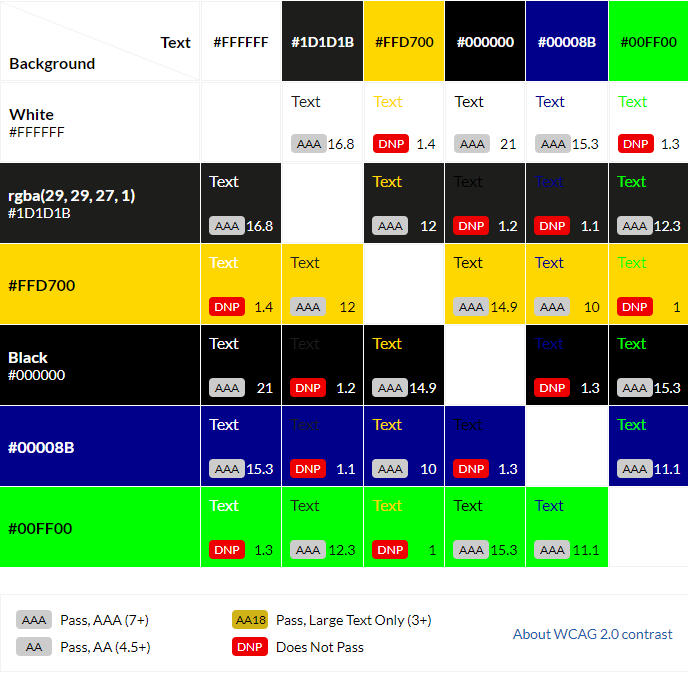

# Warhammer Fantasy Quiz

# Introduction
This website aims to test users on their knowledge in the Warhammer Fantasy Universe.

My goal is to create a functioning, responsive and fun quiz that incorporates Javascript in its fundemental design.

[Click here To View Site Live!](https://matex600.github.io/Warhammer-Quiz/)

It is recommended for users to open any links found in this README with Ctrl + left mouse button (Windows) Control + click (Mac)
# UX

## User Stories
* New Users 
  1. As a new user I want see a clearly laid out site.
  2. As a new user I want to experience a site with good visual design.
  3. As a new user I want to find a section that shows me the rules of the game.
  4. As a new user I want the site to have an interactive design
  5. As a new user I want ease of access and fluid navigation through different pages and game functions.
  6. As a new user I want the site to be responsive on multiple different displays and devices.

* Returning Users
  1. As a returning user I want to see improvements and additions to game functions and site design.
  2. As a returning user I want to see more quizes with new and interesting questions.
  3. As a returning user I want to see continued performance and accessability improvements.
  4. As a returning user I want to see if I can improve my previous high score.

## I have included the following for my target audience

* Home page with navigation, game start and leaderboard buttons.
* About page with navigation, showing rules and some background on game.
* A hero-image that is catchy and has "Warhammer" in its content helping users identify site.

# Site Design

## Composition
* [Inknut Antiqua](https://fonts.google.com/specimen/Inknut+Antiqua?query=inknut). - Font is being used for all headings.
* [Montserrat](https://fonts.google.com/specimen/Montserrat?query=mon). - Font is used for all other text 
* I feel that these two fonts fit
  well together and compliment my site. I have used sans serif as backup font,
  this is a general font and easy to read.
* I have used appropriate images for the project idea and purpose.
* The font size I have used is 1.7em for headings, 1.3em for question and other body text and 16px for buttons.
  I feel that these font sizes work well and emphasise the importance of the elements.
## Colour Scheme
* color: rgba(29, 29, 27, 0.9); Site background with transparency 0.9 to create my desired effect.
* color: #FFD700; is used for the sites "game-area" I feel it fits with my chosen theme and helps with readability.
* color: #00008B; for when the user hovers over a button as well as an underline to help the user with cursor location.
* color: #000000; I chose this colour for text inside the gold game areas to improve readability.
* color: #00FF00; I used this color for the score area for a winning point.
* color: #FFFFFF; I have used this color for negative score in score area.
* I have primarily used Hex for my colour scheme but to reach the effect for my background I used rgba also.
* All the colours have been chosen to fit with the theme I am going for as well as having high accessibility.

[Eightshapes Contrast Grid](https://contrast-grid.eightshapes.com/?version=1.1.0&background-colors=&foreground-colors=%23FFFFFF%2C%20White%0D%0A%231D1D1B%2Crgba(29%2C%2029%2C%2027%2C%201)%0D%0A%23FFD700%0D%0A%23000000%2C%20Black%0D%0A%2300008B%0D%0A&es-color-form__tile-size=compact&es-color-form__show-contrast=aaa&es-color-form__show-contrast=aa&es-color-form__show-contrast=aa18&es-color-form__show-contrast=dnp)

## Wireframes

### Wireframes created using Balsamiq

### PC

### Tablet

### Mobile

# Site Features

# Technologies Useds

## Coding Languages
* [HTML5](https://en.wikipedia.org/wiki/HTML5). - Backbone of the site.
* [CSS3](https://en.wikipedia.org/wiki/CSS). - Styles the site.
* [JS](https://en.wikipedia.org/wiki/JavaScript). - For Contacting the DOM.

# Libraries and tools
 * [Google fonts](https://fonts.google.com/). - I used Google Fonts for selecting site fonts.
 * [Github](https://github.com/). - I used github to store and release project.
 * [Gitpod](https://www.gitpod.io/). - I used gitpod to create and write code.
 * [Font Awesome](https://fontawesome.com/). - I used Font Awesome for interesting font icons.
 * [Light House](https://developers.google.com/web/tools/lighthouse). - I used this developer tool in chrome to test performance, accessibility, best practices and SEO.
 * [AmIresponsive](http://ami.responsivedesign.is/). - I used this site to add image to the top of README
 and to see how my site appears on multiple devices at the same time.

# Testing

## Validation

## HTML
 * [W3C HTML Validator](https://validator.w3.org/)

   * [Index Results - Pass](https://validator.w3.org/nu/?doc=https%3A%2F%2Fmatex600.github.io%2FWarhammer-Quiz%2Findex.html)
   * [About Results - Pass](https://validator.w3.org/nu/?doc=https%3A%2F%2Fmatex600.github.io%2FWarhammer-Quiz%2Fabout.html)
   * [Quiz Results - Pass](https://validator.w3.org/nu/?doc=https%3A%2F%2Fmatex600.github.io%2FWarhammer-Quiz%2Fquiz.html)
## CSS
 * [W3C CSS Validator](https://jigsaw.w3.org/css-validator/)
   * [CSS Results](http://jigsaw.w3.org/css-validator/validator?uri=https%3A%2F%2Fmatex600.github.io%2FWarhammer-Quiz%2F&profile=css3svg&usermedium=all&warning=1&vextwarning=)

 

## JS
 * [JSHint](https://jshint.com/)

 * No Errors in JSHint

* Testing with JSHint
   * Navigate to [JSHint](https://jshint.com/)
   * Copy Javascript code from Gitpod
   * Paste code into JSHint
   * Find Configure button
   * Enable New JavaScript features (ES6)
   * Check results on right hand side of code!

# Lighthouse

## First Phase

### Desktop
  

* I am happy with the score for my desktop lighthouse test.

### Mobile

  

  * The first mobile test has shown a minor performance issue

## Second Phase

### Mobile 

* I optimised my main image to improve performance to a satisfactory level.
# Devices Tested

## Bugs

No bugs reported as of now.

# Site Deployment

## Publishing
* Site was deployed to github pages with the following steps.
  1. Navigate to github your repositories and select my [repository](https://github.com/Matex600/Warhammer-Quiz)
  2. In the repository find "settings" scroll down to "pages" tab.
  3. Select main/master in source both are correct.
  4. Once you make a selection the page will automatically refresh.
  5. A link will be provided with succesful deployment.

## Forking
* You can contribute to this project without affecting the main branch with the following steps.
  1. Navigate to github repositores select this [repository](https://github.com/Matex600/Warhammer-Quiz)
  2. On the right of the repository name you will find the fork button next to star and watch buttons.
  3. Pressing said button will create a copy for you to use.

## Cloning
* You can clone this repository to local device with the following steps
   1.  Navigate to github repositores select this [repository](https://github.com/Matex600/Warhammer-Quiz)
   2. Under the repository name there is a green clone or download button.

Link to deployed site. --[Warhammer-Fantasy-Quiz](https://matex600.github.io/Warhammer-Quiz/)--

# Credits

## Media
[Warhammer Logo](https://static.wikia.nocookie.net/warhammerfb/images/c/c0/Warhammer-logo_%281%29.png/revision/latest/scale-to-width-down/740?cb=20200506191405). - Logo from Warhammer Fantasy Wiki.

## Acknowledgment
[Code Institute](https://codeinstitute.net/). - Preparing me for HTML, CSS and JS.

[Favicon](https://favicon.io/). - I used this site to download and implement a favicon to my site.

[Fixed Footer](https://www.w3schools.com/howto/howto_css_fixed_footer.asp). - W3schools helped me create a sticky footer.

[Balsamiq](https://balsamiq.com/). - Used to create my basic wireframes.